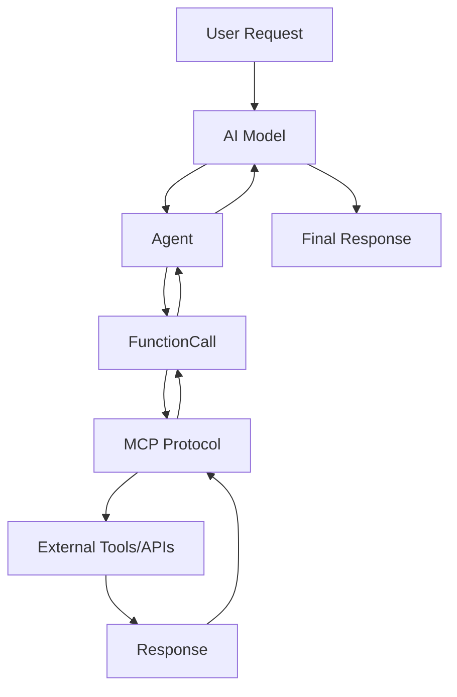

# FunctionCall、Agent、MCP：AI应用开发的三驾马车

在AI应用开发中，FunctionCall、Agent和MCP（Model Context Protocol）是三个核心概念，它们各自承担不同的角色，但又紧密协作，共同构建了现代AI应用的基础架构。本文将深入探讨这三者的关系、异同以及实际应用。

## 1. 概念解析

### 1.1 FunctionCall（函数调用）

FunctionCall是AI模型与外部工具或API交互的核心机制。它允许AI模型在执行过程中调用预定义的函数，从而扩展其能力边界。

**核心特征：**
- 结构化输入输出
- 类型安全
- 可预测的行为
- 与外部系统集成

### 1.2 Agent（智能代理）

Agent是一个自主的AI实体，能够感知环境、做出决策并执行行动。它通过FunctionCall来与外部世界交互，实现复杂的目标。

**核心特征：**
- 自主性
- 目标导向
- 环境感知
- 决策能力

### 1.3 MCP（Model Context Protocol）

MCP是一个标准化的协议，用于AI模型与外部工具和服务的安全、高效通信。它定义了模型如何发现、调用和管理外部资源。

**核心特征：**
- 标准化接口
- 安全通信
- 资源发现
- 协议统一

## 2. 关系与架构



### 2.1 层次关系

1. **MCP作为底层协议**：提供标准化的通信机制
2. **FunctionCall作为中间层**：实现具体的功能调用
3. **Agent作为顶层**：协调和管理整个执行流程

## 3. 异同对比

| 特性 | FunctionCall | Agent | MCP |
|------|-------------|-------|-----|
| **作用范围** | 单次函数调用 | 复杂任务执行 | 协议标准 |
| **抽象层次** | 低 | 高 | 中 |
| **自主性** | 无 | 高 | 无 |
| **标准化** | 部分 | 无 | 完全 |
| **复杂度** | 简单 | 复杂 | 中等 |

## 4. 代码实现示例

### 4.1 FunctionCall实现

```python
import json
from typing import Dict, Any, List
from dataclasses import dataclass

@dataclass
class FunctionCall:
    name: str
    arguments: Dict[str, Any]
    
    def execute(self, functions: Dict[str, callable]) -> Any:
        """执行函数调用"""
        if self.name not in functions:
            raise ValueError(f"Function {self.name} not found")
        
        func = functions[self.name]
        return func(**self.arguments)

# 示例函数定义
def get_weather(location: str, unit: str = "celsius") -> Dict[str, Any]:
    """获取天气信息"""
    # 模拟API调用
    return {
        "location": location,
        "temperature": 22,
        "unit": unit,
        "condition": "sunny"
    }

def send_email(to: str, subject: str, body: str) -> Dict[str, Any]:
    """发送邮件"""
    # 模拟邮件发送
    return {
        "status": "sent",
        "to": to,
        "subject": subject,
        "message_id": "msg_12345"
    }

# 函数注册
available_functions = {
    "get_weather": get_weather,
    "send_email": send_email
}

# 使用示例
weather_call = FunctionCall(
    name="get_weather",
    arguments={"location": "Beijing", "unit": "celsius"}
)

result = weather_call.execute(available_functions)
print(f"Weather result: {result}")
```

### 4.2 Agent实现

```python
from typing import List, Dict, Any
import asyncio
from enum import Enum

class AgentState(Enum):
    IDLE = "idle"
    THINKING = "thinking"
    ACTING = "acting"
    WAITING = "waiting"

class Agent:
    def __init__(self, name: str, functions: Dict[str, callable]):
        self.name = name
        self.functions = functions
        self.state = AgentState.IDLE
        self.memory = []
        
    async def process_request(self, request: str) -> str:
        """处理用户请求"""
        self.state = AgentState.THINKING
        
        # 1. 分析请求
        plan = await self._analyze_request(request)
        
        # 2. 执行计划
        self.state = AgentState.ACTING
        results = []
        
        for step in plan:
            if step["type"] == "function_call":
                result = await self._execute_function_call(step["call"])
                results.append(result)
            elif step["type"] == "reasoning":
                reasoning = await self._reason(step["context"])
                results.append(reasoning)
        
        # 3. 生成最终响应
        response = await self._generate_response(request, results)
        
        # 4. 更新记忆
        self.memory.append({
            "request": request,
            "plan": plan,
            "results": results,
            "response": response
        })
        
        self.state = AgentState.IDLE
        return response
    
    async def _analyze_request(self, request: str) -> List[Dict[str, Any]]:
        """分析请求并制定计划"""
        # 简化的计划制定逻辑
        plan = []
        
        if "天气" in request:
            plan.append({
                "type": "function_call",
                "call": FunctionCall(
                    name="get_weather",
                    arguments={"location": "Beijing"}
                )
            })
        
        if "邮件" in request:
            plan.append({
                "type": "function_call",
                "call": FunctionCall(
                    name="send_email",
                    arguments={
                        "to": "user@example.com",
                        "subject": "天气信息",
                        "body": "今日天气晴朗"
                    }
                )
            })
        
        return plan
    
    async def _execute_function_call(self, call: FunctionCall) -> Any:
        """执行函数调用"""
        return call.execute(self.functions)
    
    async def _reason(self, context: str) -> str:
        """推理过程"""
        return f"基于上下文 '{context}' 的推理结果"
    
    async def _generate_response(self, request: str, results: List[Any]) -> str:
        """生成最终响应"""
        return f"处理请求 '{request}' 完成，结果: {results}"

# 使用示例
async def main():
    agent = Agent("WeatherAgent", available_functions)
    
    response = await agent.process_request("请告诉我北京的天气，并发送邮件通知")
    print(f"Agent response: {response}")

# 运行示例
# asyncio.run(main())
```

### 4.3 MCP协议实现

```python
from typing import Dict, Any, List, Optional
import json
from dataclasses import dataclass, asdict
from abc import ABC, abstractmethod

@dataclass
class MCPRequest:
    """MCP请求结构"""
    id: str
    method: str
    params: Dict[str, Any]

@dataclass
class MCPResponse:
    """MCP响应结构"""
    id: str
    result: Optional[Dict[str, Any]] = None
    error: Optional[Dict[str, Any]] = None

@dataclass
class Tool:
    """工具定义"""
    name: str
    description: str
    input_schema: Dict[str, Any]

class MCPProtocol(ABC):
    """MCP协议抽象基类"""
    
    @abstractmethod
    async def list_tools(self) -> List[Tool]:
        """列出可用工具"""
        pass
    
    @abstractmethod
    async def call_tool(self, name: str, arguments: Dict[str, Any]) -> Any:
        """调用工具"""
        pass
    
    @abstractmethod
    async def get_resource(self, uri: str) -> Any:
        """获取资源"""
        pass

class WeatherMCP(MCPProtocol):
    """天气服务MCP实现"""
    
    def __init__(self):
        self.tools = [
            Tool(
                name="get_weather",
                description="获取指定位置的天气信息",
                input_schema={
                    "type": "object",
                    "properties": {
                        "location": {"type": "string", "description": "位置名称"},
                        "unit": {"type": "string", "enum": ["celsius", "fahrenheit"]}
                    },
                    "required": ["location"]
                }
            )
        ]
    
    async def list_tools(self) -> List[Tool]:
        return self.tools
    
    async def call_tool(self, name: str, arguments: Dict[str, Any]) -> Any:
        if name == "get_weather":
            return await self._get_weather(arguments)
        else:
            raise ValueError(f"Unknown tool: {name}")
    
    async def _get_weather(self, args: Dict[str, Any]) -> Dict[str, Any]:
        """获取天气信息"""
        location = args.get("location", "Unknown")
        unit = args.get("unit", "celsius")
        
        # 模拟API调用
        return {
            "location": location,
            "temperature": 22,
            "unit": unit,
            "condition": "sunny",
            "humidity": 65,
            "wind_speed": 10
        }
    
    async def get_resource(self, uri: str) -> Any:
        """获取资源（天气数据）"""
        if uri.startswith("weather://"):
            location = uri.replace("weather://", "")
            return await self._get_weather({"location": location})
        else:
            raise ValueError(f"Unsupported resource URI: {uri}")

class MCPClient:
    """MCP客户端"""
    
    def __init__(self, protocol: MCPProtocol):
        self.protocol = protocol
    
    async def send_request(self, request: MCPRequest) -> MCPResponse:
        """发送MCP请求"""
        try:
            if request.method == "tools/list":
                tools = await self.protocol.list_tools()
                return MCPResponse(
                    id=request.id,
                    result={"tools": [asdict(tool) for tool in tools]}
                )
            
            elif request.method == "tools/call":
                tool_name = request.params.get("name")
                arguments = request.params.get("arguments", {})
                result = await self.protocol.call_tool(tool_name, arguments)
                return MCPResponse(
                    id=request.id,
                    result={"content": result}
                )
            
            elif request.method == "resources/read":
                uri = request.params.get("uri")
                resource = await self.protocol.get_resource(uri)
                return MCPResponse(
                    id=request.id,
                    result={"contents": resource}
                )
            
            else:
                return MCPResponse(
                    id=request.id,
                    error={"message": f"Unknown method: {request.method}"}
                )
        
        except Exception as e:
            return MCPResponse(
                id=request.id,
                error={"message": str(e)}
            )

# 使用示例
async def mcp_example():
    """MCP使用示例"""
    weather_mcp = WeatherMCP()
    client = MCPClient(weather_mcp)
    
    # 1. 列出可用工具
    list_request = MCPRequest(
        id="1",
        method="tools/list",
        params={}
    )
    
    list_response = await client.send_request(list_request)
    print(f"Available tools: {list_response.result}")
    
    # 2. 调用工具
    call_request = MCPRequest(
        id="2",
        method="tools/call",
        params={
            "name": "get_weather",
            "arguments": {
                "location": "Shanghai",
                "unit": "celsius"
            }
        }
    )
    
    call_response = await client.send_request(call_request)
    print(f"Weather data: {call_response.result}")
    
    # 3. 获取资源
    resource_request = MCPRequest(
        id="3",
        method="resources/read",
        params={"uri": "weather://Beijing"}
    )
    
    resource_response = await client.send_request(resource_request)
    print(f"Resource data: {resource_response.result}")

# 运行示例
# asyncio.run(mcp_example())
```

## 5. 集成应用示例

```python
class IntegratedAISystem:
    """集成AI系统"""
    
    def __init__(self):
        self.mcp_protocols = {
            "weather": WeatherMCP(),
            # 可以添加更多MCP协议
        }
        self.agents = {}
        self.functions = {}
        
        # 初始化函数
        self._setup_functions()
    
    def _setup_functions(self):
        """设置可用函数"""
        for protocol_name, protocol in self.mcp_protocols.items():
            tools = asyncio.run(protocol.list_tools())
            for tool in tools:
                self.functions[tool.name] = self._create_function_wrapper(
                    protocol, tool.name
                )
    
    def _create_function_wrapper(self, protocol, tool_name):
        """创建函数包装器"""
        async def wrapper(**kwargs):
            return await protocol.call_tool(tool_name, kwargs)
        return wrapper
    
    async def create_agent(self, name: str, capabilities: List[str]) -> Agent:
        """创建智能代理"""
        # 根据能力需求选择函数
        agent_functions = {
            name: func for name, func in self.functions.items()
            if any(cap in name.lower() for cap in capabilities)
        }
        
        agent = Agent(name, agent_functions)
        self.agents[name] = agent
        return agent
    
    async def process_complex_request(self, request: str) -> str:
        """处理复杂请求"""
        # 创建专门的代理
        agent = await self.create_agent("TaskAgent", ["weather", "email"])
        
        # 处理请求
        response = await agent.process_request(request)
        return response

# 完整使用示例
async def integrated_example():
    """集成系统示例"""
    system = IntegratedAISystem()
    
    # 处理复杂请求
    response = await system.process_complex_request(
        "请获取北京和上海的天气信息，然后发送邮件给用户"
    )
    
    print(f"System response: {response}")

# 运行完整示例
# asyncio.run(integrated_example())
```

## 6. 最佳实践

### 6.1 FunctionCall最佳实践

1. **类型安全**：使用强类型定义函数参数
2. **错误处理**：完善的异常处理机制
3. **文档化**：清晰的函数文档和示例
4. **测试**：充分的单元测试覆盖

### 6.2 Agent最佳实践

1. **状态管理**：清晰的状态转换机制
2. **记忆管理**：合理的记忆存储和检索
3. **错误恢复**：优雅的错误处理和恢复
4. **性能优化**：异步处理和资源管理

### 6.3 MCP最佳实践

1. **协议标准化**：严格遵循MCP规范
2. **安全考虑**：输入验证和权限控制
3. **可扩展性**：支持动态工具注册
4. **监控日志**：完善的日志和监控

## 7. 总结

FunctionCall、Agent和MCP构成了现代AI应用开发的核心架构：

- **FunctionCall**提供了AI模型与外部工具交互的基础能力
- **Agent**实现了智能决策和任务协调的高级功能
- **MCP**确保了不同系统间的标准化通信

三者相互配合，形成了一个完整的AI应用生态系统。在实际开发中，应该根据具体需求选择合适的组合方式，充分发挥各自的优势。

随着AI技术的不断发展，这三个概念将继续演进，为构建更智能、更强大的AI应用提供坚实的基础。


